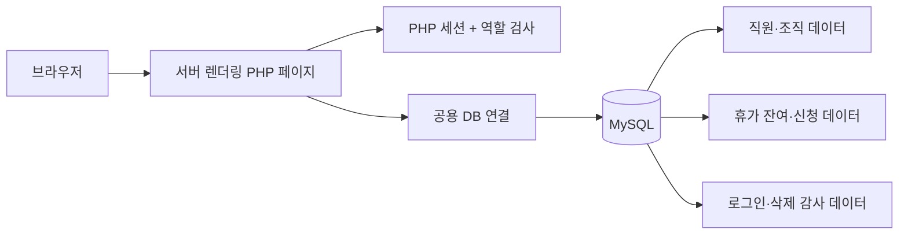

<p align="right">
  <a href="README.md">English</a> · <strong>한국어</strong>
</p>

<div align="center">
  
  <h1>Kilburnazon 인사 운영 시스템</h1>
  <p>PHP와 MySQL로 구현한 역할 기반 직원 관리 웹 애플리케이션입니다.</p>
  <p>
    
    
    
  </p>
</div>

## 프로젝트 소개

Kilburnazon 인사 운영 시스템은 직원 정보, 휴가 처리, 근태 리포트, 급여 조회, 감사 이력을 하나의 웹 애플리케이션에서 관리합니다. 일반 직원에게는 필요한 셀프서비스 기능만 제공하고, Executive 부서에는 더 넓은 운영 기능을 제공하는 두 가지 사용자 흐름을 중심으로 설계했습니다.

포트폴리오 버전에서는 프레임워크 없이 구현한 기존 PHP 방식은 유지하면서 애플리케이션, 에셋, 설정, 데이터베이스, 기술 문서의 책임을 명확히 분리했습니다.

## 이 프로젝트에서 보여주는 것

| 영역 | 구현 | 가치 |
| --- | --- | --- |
| 접근 제어 | 세션 인증과 역할별 리다이렉트 | 직원 셀프서비스와 관리자 업무를 분리 |
| 인사 운영 | 직원 CRUD, 조건 검색, 비상 연락처 | 핵심 인사 정보를 한곳에서 관리 |
| 휴가 흐름 | 신청, 잔여 일수, 승인·반려, 개인 이력 | 요청의 전체 생명주기를 구현 |
| 리포팅 | 월별 근태, 부서 통계, 급여 CSV | 운영 데이터를 실제로 활용 가능한 형태로 제공 |
| 데이터 무결성 | 외래 키, 트리거, 프로시저, 삭제 감사 로그 | 연관 데이터의 일관성과 추적 가능성 확보 |
| 비밀번호 보호 | `password_hash()`와 `password_verify()` | 평문 비밀번호 저장 방지 |

## 사용자별 기능

### 일반 직원

- 사번과 비밀번호로 로그인
- 연차, 병가, 개인 휴가 신청
- 휴가 신청 이력과 처리 상태 확인
- 비밀번호 변경

### Executive 관리자

- 직원 등록, 검색, 상세 조회, 수정, 삭제
- 휴가 신청 승인·반려 및 잔여 일수 반영
- 월별 근태와 부서별 요약 확인
- 연간·분기·월간 급여 조회 및 CSV 내보내기
- 이달의 생일자와 삭제된 직원 이력 확인

> 현재 권한 규칙은 `department_id = 2`를 Executive 역할로 사용합니다. 이는 과제 데이터 모델의 명시적인 제약이며, 실제 서비스에서는 별도의 역할·권한 테이블로 분리하는 것이 바람직합니다.

## 아키텍처



각 페이지 컨트롤러가 세션을 확인하고 MySQLi 쿼리를 실행한 뒤 한 번의 요청에서 HTML을 렌더링하는 간결한 구조입니다. 공용 연결 설정은 `config/`, 데이터베이스 초기화 자료는 `database/`에 분리했습니다.

자세한 설계 내용은 [아키텍처 문서](docs/ARCHITECTURE.md)에서 확인할 수 있습니다.

## 리포지토리 구조

```text
.
├── assets/
│   ├── css/                    # 페이지별 스타일
│   └── images/                 # 프로젝트 이미지와 기본 프로필
├── config/
│   ├── database.php            # 환경 변수 기반 DB 설정
│   └── connection.php          # 공용 MySQLi 연결
├── database/
│   ├── seeds/                  # 가상 직원 초기 데이터
│   ├── setup/                  # 스키마·초기화 스크립트
│   └── README.md               # DB 설치 가이드
├── docs/
│   └── ARCHITECTURE.md         # 시스템·데이터 흐름 설계
├── index.php                   # 애플리케이션 시작점
├── login.php                   # 로그인
├── main.php                    # 일반 직원 대시보드
├── admin_main.php              # 관리자 대시보드
└── *.php                       # 기능별 페이지
```

## 로컬 실행

### 필요 환경

- `mysqli` 확장이 활성화된 PHP 8.x
- MySQL 8.x
- PHP 내장 서버, XAMPP 또는 WAMP

### 1. 데이터베이스 설정

기본값은 `127.0.0.1:3307`, 비밀번호가 없는 `root` 사용자, `company_db` 데이터베이스입니다. 다음 환경 변수로 원하는 값을 덮어쓸 수 있습니다.

| 환경 변수 | 기본값 |
| --- | --- |
| `DB_HOST` | `127.0.0.1` |
| `DB_PORT` | `3307` |
| `DB_USER` | `root` |
| `DB_PASSWORD` | 빈 값 |
| `DB_NAME` | `company_db` |

MySQL 기본 포트를 사용하는 PowerShell 예시입니다.

```powershell
$env:DB_PORT = "3306"
php -S 127.0.0.1:8000
```

macOS/Linux에서는 다음과 같이 실행합니다.

```bash
DB_PORT=3306 php -S 127.0.0.1:8000
```

### 2. 스키마 초기화

[데이터베이스 설치 가이드](database/README.md)의 순서를 한 번씩 실행합니다. 데이터베이스 생성, 가상 데이터 가져오기, 휴가·로그인 데이터 준비, 트리거와 프로시저 설치가 진행됩니다.

### 3. 로그인

[http://127.0.0.1:8000](http://127.0.0.1:8000)에 접속합니다. 초기 계정 비밀번호는 `0000`이며 첫 로그인 후 변경을 권장합니다.

## 주요 기술적 판단

- **사용자 입력 쿼리의 Prepared Statement 적용:** 로그인, 직원 검색과 수정 흐름에서 요청 값을 직접 문자열로 연결하지 않고 바인딩합니다.
- **DB 수준의 무결성:** 외래 키로 조직·직원 정보를 연결하고, 트리거로 신규 직원의 휴가와 로그인 데이터를 생성합니다.
- **추적 가능한 삭제:** 저장 프로시저가 직원 삭제 전에 주요 정보와 처리자, 사유를 감사 테이블에 보관합니다.
- **이식 가능한 설정:** 중복된 로컬 접속 정보 대신 실행 환경 변수로 DB 설정을 변경할 수 있습니다.
- **의도적으로 단순한 기술 스택:** 프레임워크 뒤에 감추지 않고 PHP, SQL, 세션, 관계형 모델링의 기본 동작을 직접 구현했습니다.

## 다음 개선 계획

- 부서 기반 권한을 명시적인 역할·권한 모델로 교체
- CSRF 토큰, 더 엄격한 요청 검증, 운영 환경용 오류 로깅 추가
- 순차 실행 설치 파일을 버전형 마이그레이션과 멱등 시드 명령으로 전환
- 로그인, 휴가 승인, 감사 로그 통합 테스트 추가
- 기능 확장에 맞춰 공통 레이아웃과 도메인 서비스 분리

## 참고 사항

- 로컬 개발과 학습을 위한 프로젝트이며 실제 운영용 HR 시스템이 아닙니다.
- `database/seeds/employees.csv`의 모든 인물 정보는 가상 데이터입니다.
- 초기 비밀번호와 기본 DB 연결 값은 운영 환경에서 사용하면 안 됩니다.
- 커머스·배송 확장 테이블은 학습용으로 보존되어 있으며 현재 UI에서는 사용하지 않습니다.
