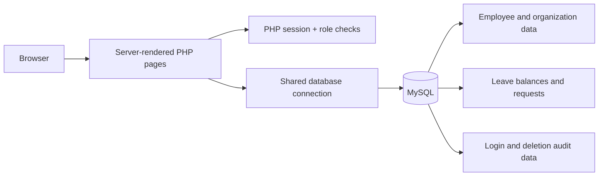

<p align="right">
  <strong>English</strong> · <a href="README.ko.md">한국어</a>
</p>

<div align="center">
  
  <h1>Kilburnazon People Operations</h1>
  <p>A role-based employee operations platform built with PHP and MySQL.</p>
  <p>
    
    
    
  </p>
</div>

## Overview

Kilburnazon People Operations brings employee records, leave workflows, attendance reporting, payroll views, and audit history into one browser-based application. It was designed around two distinct user journeys: a focused self-service experience for employees and a broader operations workspace for the Executive department.

This portfolio version organizes the original coursework into clear application, asset, configuration, database, and documentation boundaries while preserving its lightweight, framework-free PHP approach.

## What the project demonstrates

| Area | Implementation | Value |
| --- | --- | --- |
| Access control | Session authentication with role-based redirects | Separates employee self-service from administrative operations |
| People operations | Employee CRUD, searchable directory, and emergency contacts | Centralizes core workforce records |
| Leave workflow | Request, balance tracking, approval, rejection, and personal history | Models a complete request lifecycle |
| Reporting | Monthly absence summaries, department breakdowns, and payroll exports | Turns operational data into usable views |
| Data integrity | Foreign keys, triggers, a stored procedure, and deletion audit logs | Keeps related records consistent and traceable |
| Secure credentials | `password_hash()` and `password_verify()` | Avoids storing passwords in plain text |

## Product flows

### Employee workspace

- Sign in with an employee ID and password.
- Submit annual, sick, or personal leave requests.
- Review request history and approval status.
- Change the account password securely.

### Executive workspace

- Create, search, inspect, update, and remove employee records.
- Approve or reject leave requests and update balances.
- Review monthly absence and department summaries.
- Explore annual, quarterly, and monthly salary views and export CSV data.
- See upcoming birthdays and retained deletion records.

> The current authorization rule treats `department_id = 2` as the Executive role. This is documented as a deliberate constraint of the coursework data model; a dedicated roles table is the recommended production evolution.

## Architecture



The application intentionally uses a compact server-rendered architecture. Page controllers validate the session, execute MySQLi queries, and render HTML in a single request. Shared connection settings live under `config/`, and database initialization is isolated under `database/`.

For a deeper technical walkthrough, see [Architecture notes](docs/ARCHITECTURE.md).

## Repository structure

```text
.
├── config/
│   ├── database.php            # Environment-aware DB settings
│   └── connection.php          # Shared MySQLi connection
├── database/
│   ├── seeds/                  # Fictional employee seed data
│   ├── setup/                  # Schema and initialization scripts
│   └── README.md               # Database setup guide
├── docs/
│   └── ARCHITECTURE.md         # System and data-flow decisions
└── public/                     # Only web-accessible directory
    ├── assets/                 # Styles and static images
    ├── index.php               # Application entry redirect
    ├── login.php               # Authentication entry point
    ├── main.php                # Employee dashboard
    ├── admin_main.php          # Executive dashboard
    └── *.php                   # Feature pages
```

## Run locally

### Requirements

- PHP 8.x with the `mysqli` extension
- MySQL 8.x
- A local server such as PHP's built-in server, XAMPP, or WAMP

### 1. Configure the database

The defaults target `127.0.0.1:3307`, use the `root` user with no password, and create `company_db`. Override any value with environment variables:

| Variable | Default |
| --- | --- |
| `DB_HOST` | `127.0.0.1` |
| `DB_PORT` | `3307` |
| `DB_USER` | `root` |
| `DB_PASSWORD` | empty |
| `DB_NAME` | `company_db` |

PowerShell example for the standard MySQL port:

```powershell
$env:DB_PORT = "3306"
```

macOS/Linux example:

```bash
export DB_PORT=3306
```

### 2. Initialize the schema

Follow the one-time sequence in the [database setup guide](database/README.md). It creates the database, imports fictional seed data, prepares leave and login records, and installs the required trigger and stored procedure.

### 3. Start the application

Serve only the public document root so configuration and setup scripts cannot be requested from the browser:

```bash
php -S 127.0.0.1:8000 -t public
```

### 4. Sign in

Open [http://127.0.0.1:8000](http://127.0.0.1:8000). Seeded accounts initially use password `0000`; change it after the first login.

## Key engineering decisions

- **Prepared statements for user-driven queries:** Employee lookup, authentication, and update flows bind values instead of interpolating request data.
- **Database-backed invariants:** Foreign keys connect organization and employee records, while triggers provision default leave and login rows for new employees.
- **Auditable deletion:** A stored procedure snapshots essential employee and operator details before removal.
- **Portable configuration:** Runtime environment variables replace duplicated, machine-specific database settings.
- **Deliberately modest stack:** The project demonstrates PHP, SQL, sessions, and relational modeling without hiding those mechanics behind a framework.

## Next iterations

- Replace the department-based role rule with explicit roles and permissions.
- Add CSRF tokens, stricter request validation, and production-safe error logging.
- Convert ordered setup scripts into versioned migrations and an idempotent seed command.
- Add integration tests for authentication, leave approvals, and audit logging.
- Extract shared layouts and domain services as the feature set grows.

## Notes

- This is a local development and learning project, not a production HR system.
- All people in `database/seeds/employees.csv` are fictional.
- The initial password and default connection values must not be used in production.
- Optional commerce and delivery tables are retained as an extension exercise and are not used by the current UI.
