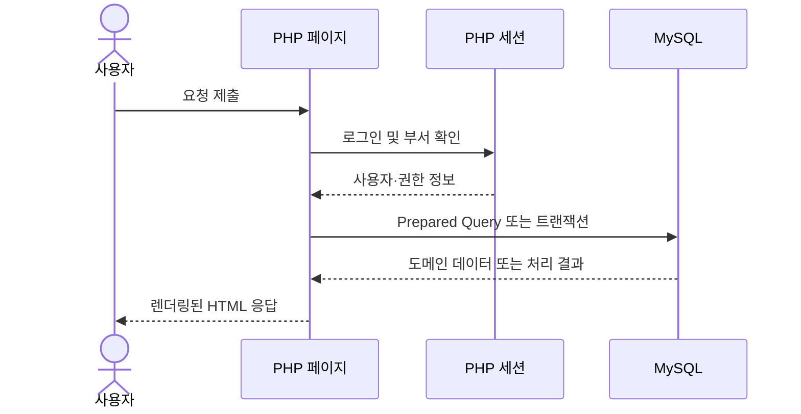
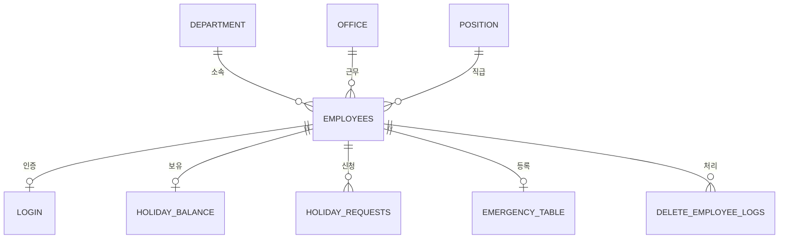

  <a href="ARCHITECTURE.md">English</a> · <strong>한국어</strong>

# 아키텍처 설계

[← 프로젝트 소개로 돌아가기](../README.ko.md)

## 시스템 개요

Kilburnazon 인사 운영 시스템은 MySQL을 사용하는 서버 렌더링 PHP 애플리케이션입니다. MySQLi 확장이 활성화된 PHP 런타임과 MySQL 서버, 브라우저만 있으면 전체 업무 흐름을 실행할 수 있도록 배포 요구 사항을 단순하게 유지했습니다.

## 책임 분리

| 영역 | 책임 |
| --- | --- |
| `public/*.php` | 요청 처리, 접근 검사, 도메인 쿼리, 화면 렌더링 |
| `config/` | 환경 변수 기반 연결 설정과 공용 MySQLi 연결 |
| `public/assets/` | 페이지 스타일과 정적 이미지 |
| `database/setup/` | 최초 스키마 생성, 데이터 변환, 트리거와 프로시저 설치 |
| `database/seeds/` | 프로젝트 초기화에 사용하는 가상 원본 데이터 |
| `docs/` | 포트폴리오용 설계 및 유지보수 문서 |

## 접근 권한 모델

| 세션 상태 | 이동 위치 | 사용 가능 기능 |
| --- | --- | --- |
| 비로그인 | `login.php` | 로그인만 가능 |
| 로그인, 일반 부서 | `main.php` | 개인 휴가와 계정 관리 |
| 로그인, `department_id = 2` | `admin_main.php` | 직원·휴가·리포트·감사 기능 |

모든 보호 페이지는 화면을 렌더링하거나 데이터를 변경하기 전에 자체적으로 접근 권한을 검사합니다. 동작을 직접 확인하기에는 단순하고 명확하지만, 중복된 검사 로직은 향후 공용 인증 헬퍼 또는 미들웨어로 분리할 수 있습니다.

## 핵심 데이터 모델

- `employees`는 중심 엔터티로 부서, 근무지, 직급 정보를 참조합니다.
- `holiday_balance`는 휴가 유형별 사용 가능 일수를 저장합니다.
- `holiday_requests`는 신청 기간, 사유, 상태, 변경 시간을 기록합니다.
- `login`은 사번을 키로 사용해 비밀번호 해시를 저장합니다.
- `delete_employee_logs`는 삭제된 직원 정보와 처리 사유의 스냅샷을 보관합니다.

## 데이터베이스 자동화

두 개의 트리거가 새 직원 등록 후 기본 데이터를 생성합니다.

1. 연차 28일, 병가 10일, 개인 휴가 5일의 휴가 잔여 레코드
2. 초기 비밀번호 해시를 담은 로그인 레코드

`delete_employee_with_log` 저장 프로시저는 직원 레코드를 삭제하기 전에 직원 정보, 처리자, 사유, 처리 시각을 기록합니다. 이후 연쇄 삭제 외래 키가 연결된 운영 데이터를 정리합니다.

## 트레이드오프와 발전 방향

현재의 페이지 컨트롤러 구조는 과제 포트폴리오에서 동작을 쉽게 따라갈 수 있지만, HTTP 처리와 SQL, HTML이 서로 결합되어 있습니다. 기능이 확장된다면 공용 인증 미들웨어를 먼저 분리하고 직원과 휴가 영역의 Repository 및 Service 계층을 도입하는 것이 효과적입니다.

부서 ID에 역할을 연결한 현재 규칙 역시 숨기지 않고 제약 사항으로 문서화했습니다. 실제 서비스에서는 사용자, 역할, 권한, 역할 할당을 별도로 모델링해 조직 구조와 접근 권한을 독립적으로 변경할 수 있어야 합니다.

## 보안 상태

현재 프로젝트는 비밀번호 해싱, 세션 인증, 주요 화면의 출력 이스케이프, 핵심 사용자 입력 쿼리의 값 바인딩을 적용했습니다. `public/`을 문서 루트로 사용해 설정과 데이터베이스 설치 스크립트는 브라우저 접근 범위 밖에 둡니다. 실제 운영 전에는 CSRF 방어, 일관된 입력 검증, 안전한 세션 쿠키 설정, 요청 속도 제한, 비밀 정보 관리가 추가로 필요합니다.
