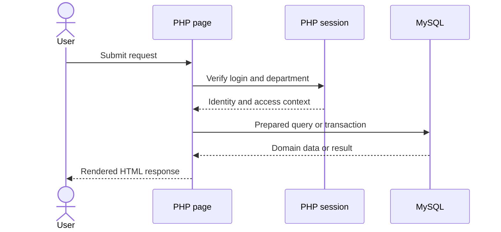
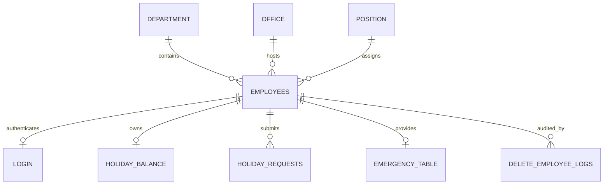

  <strong>English</strong> · <a href="ARCHITECTURE.ko.md">한국어</a>

# Architecture Notes

[← Back to the project overview](../README.md)

## System context

Kilburnazon People Operations is a server-rendered PHP application backed by MySQL. It keeps deployment requirements intentionally small: a PHP runtime with MySQLi, a MySQL server, and a browser are enough to run the complete workflow.

## Responsibility boundaries

| Boundary | Responsibility |
| --- | --- |
| Root PHP pages | Request handling, access checks, domain queries, and rendered views |
| `config/` | Environment-aware connection settings and the shared MySQLi connection |
| `assets/` | Page presentation and static imagery |
| `database/setup/` | One-time schema, seed transformation, triggers, and stored procedure setup |
| `database/seeds/` | Fictional source records used to initialize the project |
| `docs/` | Portfolio-facing design and maintenance context |

## Access model

| Session state | Destination | Capability |
| --- | --- | --- |
| Not authenticated | `login.php` | Authentication only |
| Authenticated, non-Executive | `main.php` | Personal leave and account actions |
| Authenticated, `department_id = 2` | `admin_main.php` | Employee, leave, reporting, and audit operations |

Every protected page performs its own guard before rendering or mutating data. This is simple and visible, but repeated guard logic is a strong candidate for middleware or a shared authorization helper in a future refactor.

## Core data model

- `employees` is the central record and references department, office, and position dimensions.
- `holiday_balance` stores the available allowance by leave type.
- `holiday_requests` records date ranges, reasons, status, and update time.
- `login` stores password hashes keyed by employee ID.
- `delete_employee_logs` preserves a snapshot and deletion reason for audit review.

## Database automation

Two triggers provision default records after a new employee is inserted:

1. A leave balance with 28 annual, 10 sick, and 5 personal days.
2. A login row with the initial password hash.

The `delete_employee_with_log` stored procedure captures the employee snapshot, operator identity, reason, and timestamp before deleting the primary employee record. Cascading foreign keys then remove dependent operational records.

## Trade-offs and evolution path

The current page-controller structure makes the application easy to inspect for a coursework portfolio, but it couples HTTP handling, SQL, and HTML. If the system grows, the next useful boundary would be shared authentication middleware followed by repositories/services for employees and leave.

The department-based role rule is also intentionally documented rather than hidden. A production evolution should introduce users, roles, permissions, and role assignments so organization structure and authorization can change independently.

## Security posture

The project hashes passwords, uses session-based authentication, escapes rendered employee data in key views, and binds parameters for core user-driven queries. Before production use, it still needs CSRF protection, consistent input validation, secure session-cookie settings, rate limiting, secret management, and non-public database setup routes.
